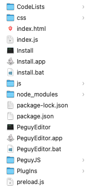
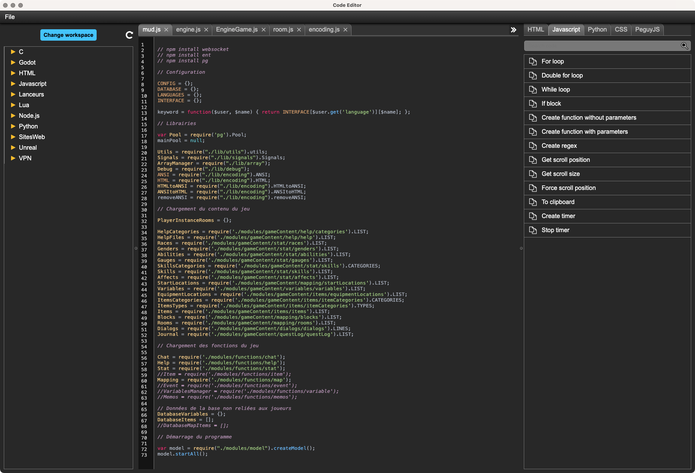
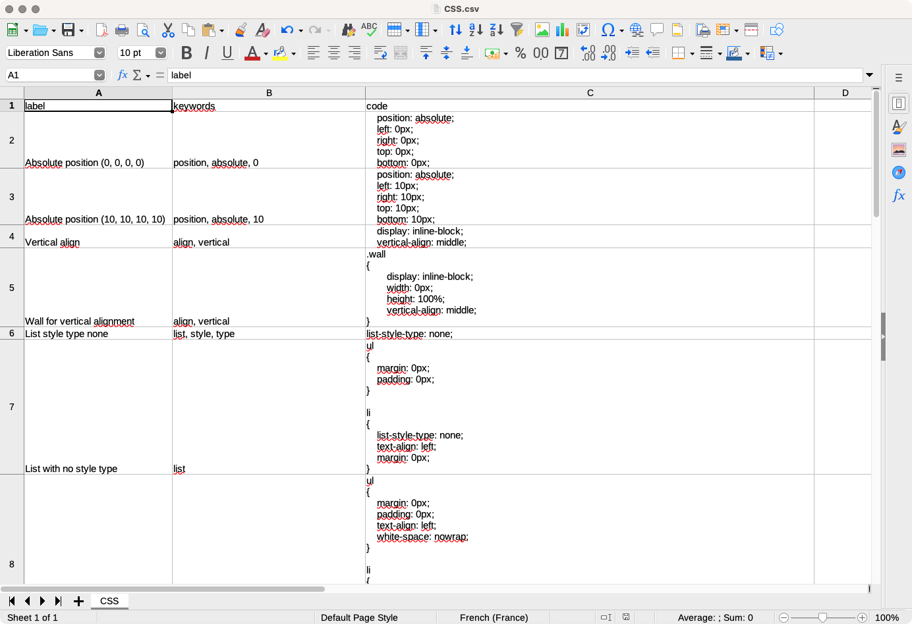
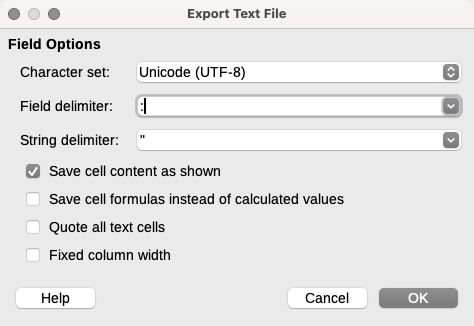

# Péguy Editor

Péguy Editor is a small code editor based on [Electron](https://www.electronjs.org/), [Péguy.js](https://github.com/Killfaeh/Peguy.js) and [highlight.js](https://highlightjs.org/). </br>
It offers a library of ready-to-use code blocks that can be customized to suit your needs. 
This allows you to write code quickly without using online chatbots.
It's also a way of centralizing your entire knowledge base.

## Installation

### Install Node.js

You need to install Node.js to run Péguy Editor.

**Windows**

Download the installation file on Node.js web site : [https://nodejs.org/fr/download/prebuilt-installer](https://nodejs.org/fr/download/prebuilt-installer) </br>
Run it as administrator.

**Mac OS**

Open a terminal. </br>
Install Homebrew if you haven't already.

```bash
/bin/bash -c "$(curl -fsSL https://raw.githubusercontent.com/Homebrew/install/HEAD/install.sh)"
```

Then, install Node.js and npm.

```bash
brew install node
brew install npm
```

**Linux**

Open a terminal and run these 2 commands.

```bash
sudo apt install nodejs
sudo apt install npm
```

### Download and extract the archive

Download the project archive via this Google Drive link : [https://drive.google.com/file/d/1gWRVWW9li51609z9BfiJkvzBM3MaxLfr/view?usp=sharing](https://drive.google.com/file/d/1gWRVWW9li51609z9BfiJkvzBM3MaxLfr/view?usp=sharing) </br>
Then, extract it.

<div align="center">
</br>
Archive content
</div>

### Run the application

**Windows**

If you run Péguy Editor for the first time, run install.bat (double click).</br>
Then, run PeguyEditor.bat (double click).

**Mac OS**

Run PeguyEditor.app (double click).</br>
You can put PeguyEditor.app in your dock.

**Linux**

Run PeguyEditor in a terminal.

## How to use

<div align="center">

</div>

You can open a workspace by clicking on the button "Change Workspace".</br>
In the right panel, there is the ready-to-use code blocks library. 
You can paste a code block in your code by double clicking on the label of the row or simple clicking on the corresponding copy/paste icon.

## Customize the code blocks library

If you have run Péguy Editor at least once the directory Peguy/CodeEditor/CodeLists has been created in your Documents directory.</br>
You can create your own library by creating some CSV files in this directory.</br>
Here is how to format each CSV file.

<div align="center">

</div></br>

In the first row, put the columns labels : "label", "keywords" and "code".</br>
Then, for each following row, put the label of the row in the first column, the keywords separate with "," in the second column and the code block in the third column.</br>

<div align="center">

</div>
